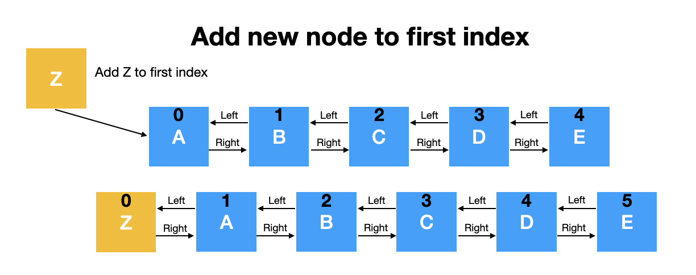
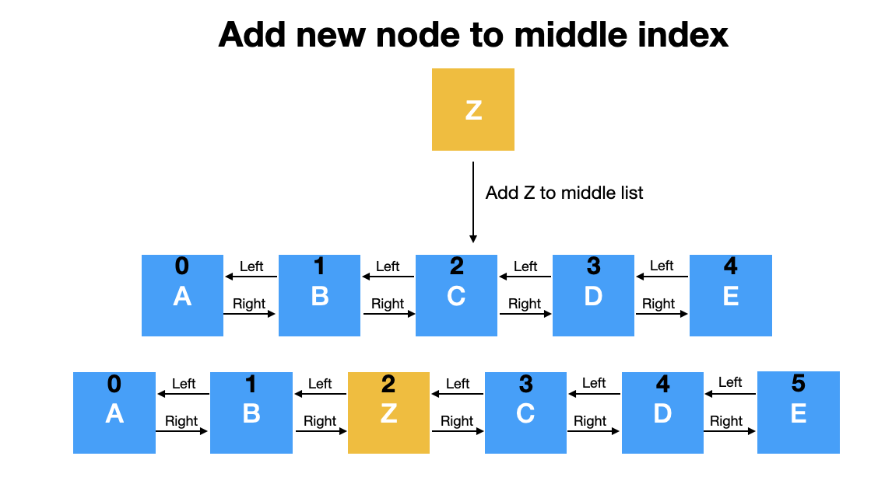
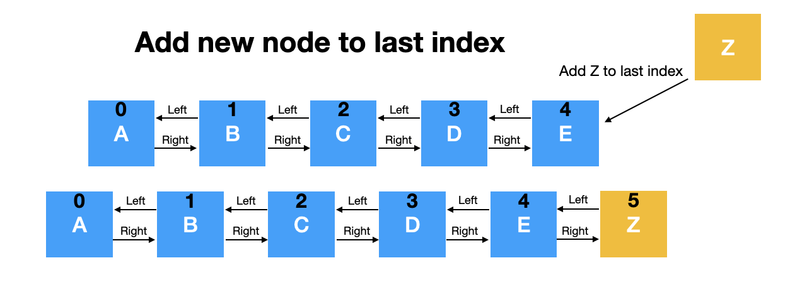

# doubly-linked-list
## Introduction
I believe that anyone who codes in Java will eventually encounter a linked list. It's simple to use; Java already provides interfaces for us. However, despite my frequent use of it, I still lack a thorough understanding of its internal workings. Therefore, in this blog, I will delve deeply into the implementation of Linked List, its pros and cons, and other related topics. I hope this blog could be beneficial to someone who is looking to learn about LinkedIn as well.

## LinkedList vs String[]
When managing collections of data in Java, choosing the right data structure is crucial for efficient performance and flexibility. Here, we compare LinkedList<String> with String[] to illustrate when and why you might prefer using a linked list over an array of strings:

| Feature / Consideration     | `String[]` (Array of Strings)                 | `LinkedList<String>` (Linked List of Strings)                           |
|-----------------------------|-----------------------------------------------|-------------------------------------------------------------------------|
| **Fixed Size**              | Yes                                           | No                                                                      |
| **Random Access**           | Yes (by index)                                | No (sequential access required for traversal)                           |
| **Memory Efficiency**       | More memory-efficient (contiguous storage)    | Less memory-efficient (uses more memory due to node overhead)           |
| **Insertions and Deletions**| Slower for large arrays (shift elements)      | Faster (adjusts references, no need to shift elements)                  |
| **Dynamic Size**            | No                                            | Yes                                                                     |
| **Performance Considerations** | Efficient for random access operations     | Efficient for frequent insertions/deletions and iteration operations     |

### Key Points of Comparison:

- **Fixed vs. Dynamic Size:**
  - `String[]`: Suitable when the number of elements is constant.
  - `LinkedList<String>`: Ideal for collections with varying sizes.

- **Access Patterns:**
  - `String[]`: Efficient for random access using indices.
  - `LinkedList<String>`: Efficient for sequential access and frequent insertions/deletions.

- **Memory Usage:**
  - `String[]`: More memory-efficient due to contiguous storage.
  - `LinkedList<String>`: Uses more memory due to node overhead.

### Conclusion

Choose `String[]` for fixed-size collections requiring efficient random access. Opt for `LinkedList<String>` when flexibility in size and efficient insertions/deletions are needed. Understanding these differences helps optimize performance and scalability in Java applications.

## Singly vs. Doubly Linked Lists
When managing collections of data in Java, linked lists offer dynamic size and efficient insertions and deletions. Here, we compare the two main types of linked lists: singly linked lists and doubly linked lists.

### Comparison of Singly and Doubly Linked Lists

| Feature / Consideration     | Singly Linked List                               | Doubly Linked List                               |
|-----------------------------|--------------------------------------------------|--------------------------------------------------|
| **Node Structure**          | Each node has data and a reference to the next node | Each node has data, a reference to the next node, and a reference to the previous node |
| **Memory Efficiency**       | More memory-efficient (less overhead)            | Less memory-efficient (more overhead due to extra reference) |
| **Traversal**               | One direction (forward)                          | Two directions (forward and backward)            |
| **Insertion/Deletion Complexity** | Efficient (O(1)) at the head, O(n) elsewhere | Efficient (O(1)) at both head and tail, O(n) elsewhere |
| **Use Cases**               | Simple list operations, stacks   

Because doubly linked lists offer more comprehensive functionality compared to singly linked lists, this blog will focus on implementing doubly linked lists.\
However, the concepts and methods discussed can also be applied to singly linked lists. Understanding these differences will help you optimize performance and memory usage in Java applications.

## Doubly Linked Lists

  

- **Head and Tail**
  - `Head`: The first node in the doubly linked list. It points to the second node via its "next" reference. The "previous" reference of the head node is null or None.
  - `Tail`: The last node in the doubly linked list. It points to null or None via its "next" reference. The "previous" reference of the tail node points to the node before it.

- **Left and Right**
  - `Left`: In the context of a doubly linked list, moving left means moving towards the head of the list (following the "previous" references).
  - `Right`: Moving right means moving towards the tail of the list (following the "next" references).

- **Traverse**
  - `Head to Tail`: Start at the head node and follow the "Right" references (or "next" references) from one node to the next until you reach the tail node.
  - `Tail to Head`: Start at the tail node and follow the "Left" references (or "previous" references) from one node to the previous until you reach the head node.

## Main Functionalities of a Doubly Linked List
When implementing a doubly linked list in Java, the following functionalities are essential:
1. **Node Class**
    - A nested class representing each node in the list.
    - Each node contains data, a reference to the next node, and a reference to the previous node.

2. **Initialization**
    - A constructor to initialize the linked list.
    - Typically includes a head (first node) and a tail (last node) reference.

3. **Insertion Operations**
    - **Insert at the Beginning**: Adds a new node at the start of the list.
    - **Insert at the End**: Adds a new node at the end of the list.
    - **Insert at a Specific Position**: Adds a new node at a specified position within the list.

4. **Deletion Operations**
    - **Delete from the Beginning**: Removes the node at the start of the list.
    - **Delete from the End**: Removes the node at the end of the list.
    - **Delete a Specific Node**: Removes a node at a specified position within the list.

5. **Traversal**
    - **Forward Traversal**: Traverses the list from the head to the tail.
    - **Backward Traversal**: Traverses the list from the tail to the head.

6. **Search**
    - Searches for a node containing specific data.
    - Returns the position or a reference to the node if found.

7. **Update**
    - Updates the data of a node at a specific position.

8. **Size**
    - Returns the number of nodes in the list.

9. **IsEmpty**
    - Checks if the list is empty.

10. **Clear**
    - Removes all nodes from the list, resetting it to an empty state.

## Challenges of implementation
According to my experience implementing the functionalities mentioned earlier, the most challenging tasks are\
**inserting a specific position** and **deleting a specific node**. These operations require careful management of node connections to maintain the integrity and sequence of the linked list.\
Therefore, I have created the images to provide an overview of the insertion parts, which it can also adopt and delete as well.\
Please review the attached document.

  

  

  

Big O, Best case, Worst, Average
